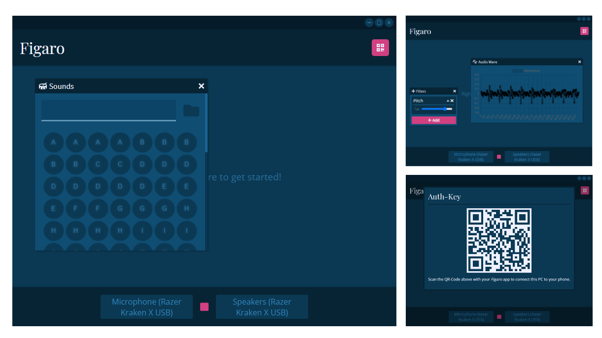

<p align="center">
  
</p>
<h1 align="center">Figaro</h1>
<p align="center">
  
  
  
</p>

---

## About

Real-time open-source voice modification program & sound board. Can be useful for many things, especially when used in combination with virtual sound i/o devices.




## Table of Contents

- [About](#about)
- [Table of Contents](#table-of-contents)
- [Setup](#setup)
  - [Development](#development)
    - [Linux](#linux)
    - [Mac](#mac)
    - [Windows](#windows)
    - [Manual Setup](#manual-setup)
  - [Advanced setup](#advanced-setup)
- [Usage](#usage)
  - [CLI](#cli)
  - [GUI](#gui)
  - [Figaro-Script](#figaro-script)
    - [General Syntax](#general-syntax)
    - [Defining a Hotkey](#defining-a-hotkey)
    - [Comments](#comments)
    - [Builtins](#builtins)
      - [Pause](#pause)
- [Roadmap](#roadmap)
- [References](#references)

## Setup

If you're just looking to use *Figaro* and not work on it, then there's no reason to set up the development environment like described below, simply download the appropriate release for your platform from the [releases](https://github.com/MattMoony/figaro/releases) page and you're good to go!

<div align="center">
  <a href="https://github.com/MattMoony/figaro/releases/download/v0.3-alpha/Figaro.Setup.0.3.0-alpha.exe"></a>
  <a href="https://github.com/MattMoony/figaro/releases/download/v0.3-alpha/figaro-gui-0.3.0-alpha.tar.gz"></a>
</div>

### Development

If you're on `Linux`, `Windows` or `Mac`, then setting up should be easy! Simply run the appropriate setup script and it will guide you through the whole process.

#### Linux

Make `./setup.sh` executable ... (or run it with an appropriate interpreter) ...

```bash
chmod 755 ./setup.sh
```

... execute it: `./setup.sh` ... and have fun with `python figaro.py`!

#### Mac

The same as the [Linux Setup](#linux), just use `./setup-mac.sh` instead of `./setup.sh`.

#### Windows

First, in order to allow the setup _powershell_ script to run, you need to execute the following command in an administrator powershell:

```ps
Set-ExecutionPolicy RemoteSigned
```

... afterwards, executing `.\setup.ps1` will guide you through the whole setup process! You can now execute `python figaro.py`.

#### Manual Setup

First of all, for `Figaro` to be able to work with audio files other than `wav`, you need to download and install `ffmpeg` (see [References](#References) for the link to the official download page).

- **Linux**: `pip install -r requirements-unix.txt`
- **Mac**: `pip install -r requirements-unix.txt`
- **Windows**: `pip install -r requirements-windows.txt`

... if you're on **Windows** and you get an error when installing `PyAudio` try downloading a PIP wheel suitable for your Python version from the link provided in [References](#References).

If everything works out, you're good to go!

### Advanced setup

The following steps will explain how to use this program with the commonly used voice-chat application `Discord` on Windows:

1. Download and install a virtual audio input device (if you don't know any specific one, try the one mentioned in [References](#References)).
2. When selecting an output device at the startup of `Figaro`, choose the virtual input device you just installed (e.g.: `CABLE Input`).
3. In Discord, go to `User Settings > Voice & Video > Input Device` and select the virtual input device from the dropdown (e.g.: `CABLE Output`).
4. There you go, your friends should only be able to hear your filtered voice now.

## Usage

### CLI

CLI-Usage is explained [here](docs/cli.md).

### GUI

GUI-Usage is explained [here](docs/gui.md).

### Figaro-Script

You can now also use figaro script (.fig) for defining hotkeys and their behaviour. Whether you want a sound effect to be played, or an attribute to be shown, it can all be bound to a certain keypress.

#### General Syntax

Figaro-Script was heavily inspired by [AutoHotkey](https://www.autohotkey.com/), so, if you are capable of defining hotkeys and their functionality with ahk-script, think of this as a very, very simplified version of that.

But, if you aren't aware of ahk, let me introduce you to the basic syntax very quickly:

Your script, the .fig file, consists of multiple hotkey-definition blocks which tell Figaro which key combinations should result in what behaviour. Apart from that, you can also have comments, to make your script more readable and easier to understand for a future you.

#### Defining a Hotkey

In order to define which keys make up your hotkey, you just need to write all of them in one line and end it with `::`. After this first line, you write all your commands and end the definition block with `return`. This could look something like the following:

```text
...

q::
start sound tmp/asdf.mp3 2
return

...
```

... this hotkey would be triggered every time the `q` is pressed.

Certain control keys need alternative symbols (this is equalivalent to ahk-script):

* `alt` is represented by `!`
* `ctrl` is represented by `^`
* `shift` is represented by `+`

... keep in mind that the definition of hotkeys is usually case insensitive, which means in order to, for example, only trigger the hotkey on an uppercase `Q`, you would need to use `+q::` as your definition.

#### Comments

This is fairly easy to explain. If you have ever used a popular programming language such as C, C++, Java, etc. you already know how to use comments. The only thing to bear in mind is that so far, I have only implemented `single-line` comments.

For people who have never used such a programming language before, this is the correct syntax for comments in Figaro-Script:

```text
...

// triggered by pressing `lower-case q`
// will play the mp3 file "tmp/asdf.mp3" at 200% of the original volume ...
q::
start sound tmp/asdf.mp3 2
return

...
```

#### Builtins

Despite the CLI commands, certain builtin functions are also available to you (at the moment there aren't many, but I will at more should the need to do so arise):

##### Pause

You can use this command in order play a sound effect, or do anything else for that matter, after waiting for a given amount of `milliseconds`. E.g.:

```text
...
start sound tmp/1.mp3
pause 3000
start sound tmp/2.mp3
...
```

... this would play the sound effect `tmp/1.mp3`, wait for `3 seconds` and then play the next sound effect `tmp/2.mp3`.

_More docs coming soon! Disclaimer: Some of the commands described above might still be removed or altered..._

## Roadmap

Just a small preview of what is about to come. It's very likely that this roadmap will continue to grow in the future, as I get more ideas or if somebody wants to contribute.

* [x] [CLI](#cli)
  * [x] I/O device selection
  * [x] Live status (live audio graph in console)
  * [x] Filter control
  * [x] Sound effects (soundboard-like abilities)
* [ ] [GUI](#gui)
  * [x] I/O device selection
  * [x] Live sound wave graph
  * [x] Filter control
  * [ ] Soundboard
    * [x] Functionality
    * [ ] Advanced features
* [x] Filters
  * [x] Volume
  * [x] Pitch-Shift
  * [x] "Trippy"-Filter
  * [x] Echo
  * [x] Noise
  * [x] Crackle
  * [x] Randomized
* [ ] [Figaro-Script](#figaro-script)
  * [x] Using CLI commands
  * [x] Hotkeys
  * [ ] Advanced builtins
* [ ] Security
  * [x] Remote Authentication
  * [x] Encrypted sockets
  * [ ] Fine-grained settings

## References

* Windows Virtual Sound I/O ... [vb-audio](https://www.vb-audio.com/Cable/)
* PyAudio Windows Wheel ... [uci](https://www.lfd.uci.edu/~gohlke/pythonlibs/#pyaudio)
* FFmpeg download ... [ffmpeg.org](https://ffmpeg.org/download.html)
* JWT minimum secret length ... [RFC 7518](https://tools.ietf.org/html/rfc7518#section-3.2)
* JWT recommended secret length ... [Auth0](https://auth0.com/blog/brute-forcing-hs256-is-possible-the-importance-of-using-strong-keys-to-sign-jwts/)

---

... MattMoony (June 2021)
