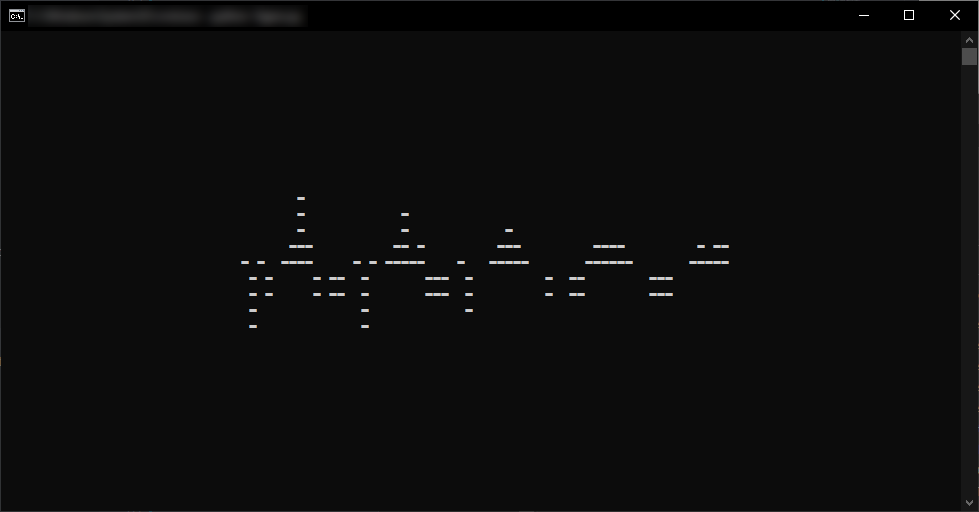

# Figaro

---

## About

Real-time open-source voice modification program. Can be useful for many things, especially when used in combination with virtual sound i/o devices.

## Table of Contents

* [About](#About)
* [Table of Contents](#Table-of-Contents)
* [Setup](#Setup)
  * [Advanced setup](#Advanced-setup)
* [Usage](#Usage)
  * [CLI](#CLI)
* [Roadmap](#Roadmap)
* [References](#References)

## Setup

First of all, for `Figaro` to be able to work with audio files other than `wav`, you need to download and install `ffmpeg` (see [References](##References) for the link to the official download page).

If you have Python 3.x installed, try installing the requirements:

```bash
$ python -m pip install -r requirements.txt
```

... if you're on Windows and you get an error when installing `PyAudio` try downloading a PIP wheel suitable for your Python version from the link provided in [References](##References).

If everything works out, you're good to go!

### Advanced setup

The following steps will explain how to use this program with the commonly used voice-chat application `Discord` on Windows:

1. Download and install a virtual audio input device (if you don't know any specific one, try the one mentioned in [References](##References)).
2. When selecting an output device at the startup of `Figaro`, choose the virtual input device you just installed (e.g.: `CABLE Input`).
3. In Discord, go to `User Settings > Voice & Video > Input Device` and select the virtual input device from the dropdown (e.g.: `CABLE Output`).
4. There you go, your friends should only be able to hear your filtered voice now.

## Usage

### CLI

All you need to do is to run the following ...

```bash
$ python figaro.py
```

... and whenever you feel lost, just type `help` or `?` and hit enter.

Still, I want you to present with some of the very basic features, to make life a little easier for you and to make this readme more complete. So... here we go!

#### Display all available audio devices

To see which devices are available, use this very simple command ...

```bash
figaro$ show devices
```

#### Configure input/output

Use the `set` command to configure your basic input / output settings. In order to change your microphone, use ...

```bash
figaro$ set input <device-index>
```

... you can use the same syntax for configuring one output device. Keep in mind however that audio will only be forwared to this device then (previously added devices will be stopped, unless added again) ...

```bash
figaro$ set output <device-index>
```

#### Inspect current configuration

To display the audio channel's current setup, use the `show` command ...

```bash
figaro$ show status
```

... this will tell you, which microphone is currently being used and where the audio is being written to (possibly multiple output devices). It will also tell you, whether the channel is active or not.

#### Show live audio feed

To get a CLI preview of the audio feed in real-time, you have to use the `show` command once again ...

```bash
figaro$ show audio
```

... this will present you with a live console preview of the audio that is being processed and forwarded.

<p align="center">
  
</p>

#### Start/stop the audio channeling

This part is very easy, you can probably guess what the commands will be. To start the channeling process, use ...

```bash
figaro$ start
```

... and to stop reading, processing and writing audio, simply enter ...

```bash
figaro$ stop
```

... very difficult and hard to remember... I know!

#### Using sound effects

You can also use `Figaro` for soundboard-like functionality now. To play any sound file (`wav`, `mp3`, `ogg`, ...) in real-time, simply use ...

```bash
figaro$ add sound <path-to-sound-effect>
```

... if you want to stop a sound effect, what you have to do first is find its `index` ...

```bash
figaro$ show sounds
```

... this command will provide you with everything you need. It shows you a list of the currently playing sound effects and their respective filenames and `indices`. After that, use ...

```bash
figaro$ del sound <sound-index>
```

... to stop the sound effect.

_More docs coming soon! Disclaimer: Some of the commands described above might still be removed or altered..._

## Roadmap

Just a small preview of what is about to come. It's very likely that this roadmap will continue to grow in the future, as I get more ideas or if somebody wants to contribute.

* [ ] CLI
  * [x] I/O device selection
  * [x] Live status (live audio graph in console)
  * [ ] Filter control
  * [x] Sound effects (soundboard-like abilities)
* [ ] GUI
  * [ ] Functionality
  * [ ] Design
* [ ] Filters
  * [x] Volume
  * [ ] Pitch-Shift
  * [ ] Randomized

## References

Windows Virtual Sound I/O ... [vb-audio](https://www.vb-audio.com/Cable/)

PyAudio Windows Wheel ... [uci](https://www.lfd.uci.edu/~gohlke/pythonlibs/#pyaudio)

FFmpeg download ... [ffmpeg.org](https://ffmpeg.org/download.html)

---

... MattMoony (June 2020)