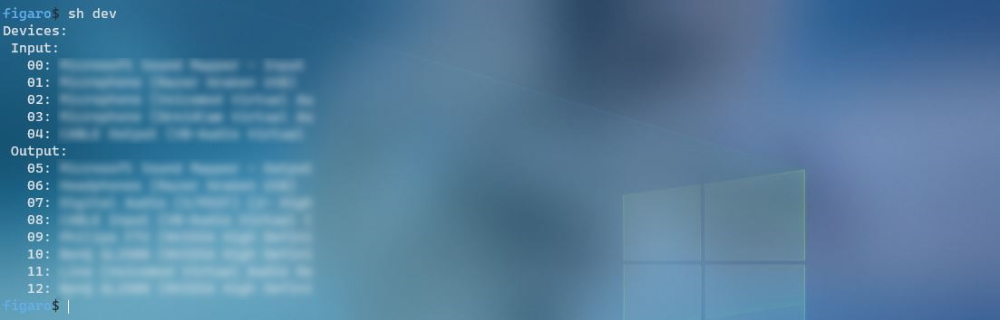
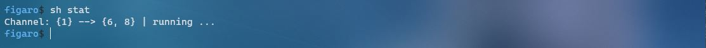
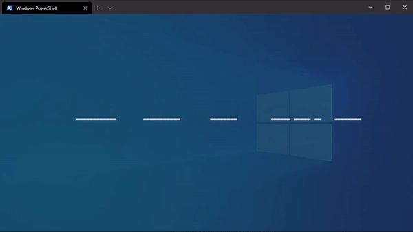
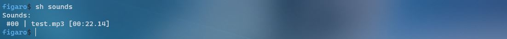
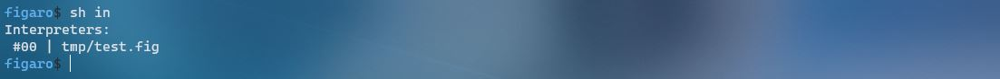
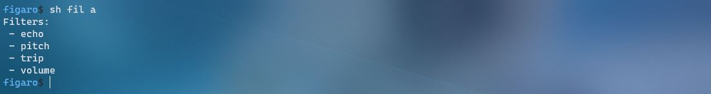

# CLI - Usage

All you need to do is to run the following ...

```bash
$ python figaro.py
```

... and whenever you feel lost, just type `help` or `?` and hit enter.

Still, I want you to present with some of the very basic features, to make life a little easier for you and to make this readme more complete. So... here we go!

## CLI parameters

Before even entering the Figaro CLI, you can already configure your audio setup by using CLI parameters. The following is a table of all available parameters and their purpose:

| Parameter                        | Help                                                                                                                                                                                |
| -------------------------------- | ----------------------------------------------------------------------------------------------------------------------------------------------------------------------------------- |
| -h, --help                       | Display a list of all parameters and what they're used for.                                                                                                                         |
| -g, --gui                        | Start with a GUI.                                                                                                                                                                   |
| -f <filename>, --file <filename> | Interpret the file with name `<filename>` as a Figaro script and run it.                                                                                                            |
| -i <ist>, --ist <ist>            | Start (an) input stream(s) (`ist`) using the device(s) with the index/indices `<ist1>,...,<istN>`. More on devices and their indices [here](#display-all-available-audio-devices).  |
| -o <ost>, --ost <ost>            | Start (an) output stream(s) (`ost`) using the device(s) with the index/indices `<ost1>,...,<ostN>`. More on devices and their indices [here](#display-all-available-audio-devices). |

## Basic CLI usage

The two most essential commands when using the Figaro CLI are `help` and `clear`. You might be able to guess their respective meanings already.

* `help` or `?` ... can be used in pretty much any place in the CLI. It will (hopefully) always be able to provide you with some useful info to help you navigate your way through the vast depths of this interface.
* `clear` or `cls` ... simply clears the console - I tend to use this command nearly obsessively. After displaying some info - `clear` - after configuring input and output - `clear` - and so on and so forth.

## Display all available audio devices

To see which devices are available, use this very simple command ...

```bash
figaro$ show devices
```

<p align="center">
  
</p>

## Configure input/output

Use the `start` command to configure your basic input / output settings. In order to change your microphone, use ...

```bash
figaro$ start input <device-index>
```

<p align="center">
  
</p>

... you can use the same syntax for configuring one output device. Keep in mind however that audio will only be forwared to this device then (previously added devices will be stopped, unless added again) ...

```bash
figaro$ start output <device-index>
```

<p align="center">
  
</p>

## Inspect current configuration

To display the audio channel's current setup, use the `show` command ...

```bash
figaro$ show status
```

<p align="center">
  
</p>

... this will tell you, which microphone is currently being used and where the audio is being written to (possibly multiple output devices). It will also tell you, whether the channel is active or not.

## Show live audio feed

To get a CLI preview of the audio feed in real-time, you have to use the `show` command once again ...

```bash
figaro$ show audio
```

... this will present you with a live console preview of the audio that is being processed and forwarded.

<p align="center">
  
</p>

## Start/stop the audio channeling

This part is very easy, you can probably guess what the commands will be. To start the channeling process, use ...

```bash
figaro$ start
```

... and to stop reading, processing and writing audio, simply enter ...

```bash
figaro$ stop
```

... very difficult and hard to remember... I know!

## Using sound effects

You can also use `Figaro` for soundboard-like functionality now. To play any sound file (`wav`, `mp3`, `ogg`, ...) in real-time, simply use ...

```bash
figaro$ start sound <path-to-sound-effect>
```

<p align="center">
  
</p>

... by the way, if you want to amplify the sound's volume, just pass the scaling factor after the `<path-to-sound-effect>` parameter like so:

```bash
figaro$ start sound <path-to-sound-effect> <scaling-factor>
```

... if you want to stop a sound effect, what you have to do first is find its `index` ...

```bash
figaro$ show sounds
```

<p align="center">
  
</p>

... this command will provide you with everything you need. It shows you a list of the currently playing sound effects and their respective filenames and `indices`. After that, use ...

```bash
figaro$ stop sound <sound-index>
```

<p align="center">
  
</p>

... to stop the sound effect.

## Start/stop interpreting a Figaro Script

To start interpreting a Figaro Script (`<filename>`) from inside the Figaro CLI, use the following command:

```bash
figaro$ start interpreter <filename>
```

<p align="center">
  
</p>

... to then stop this script from running, use ...

```bash
figaro$ stop interpreter <intrp-index>
```

<p align="center">
  
</p>

... replacing `<intrp-index>` with the index of the interpreter you want to stop (or `a` to stop all running interpreters).

How to get an interpreter's index is explained [here](#show-all-running-interpreters). More on Figaro Script can be found [here](#figaro-script).

## Show all running interpreters

This is quite simple. In a similar fashion to all other commands for displaying info, use the `show` command, this time in conjunction with the keyword `interpreters`, which will either present you with a list of all currently running interpreters (+ their respective indices) or tell you that none are in fact active at the moment ...

```bash
figaro$ show interpreters
```

<p align="center">
  
</p>

## Using voice-filters

This part of Figaro will allow you to alter your voice's (or rather the audio input stream's) volume, pitch, etc.

First, to see which filters are available to you, use the proper `show` command:

```bash
figaro$ show filters all
```

<p align="center">
  
</p>

... to actually apply one of those filters, use a command in compliance with the following pattern:

```bash
figaro$ start filter <filter-name> <filter-arg0> ... <filter-argN>
```

<p align="center">
  
</p>

... where `<filter-name>` should be replaced with the name you retrieved from the show command [mentioned above](#using-voice-filters) and `<filter-arg0>` to `<filter-argN>` should be replaced with the arguments the filter requires.

(If you don't know what arguments you need to provide, keep reading the docs or simply try to apply the filter without arguments. It'll usually tell you what it requires.)

Once you have successfully applied a filter, you'll be able to see it in the list of currently active filters:

```bash
figaro$ show filters
```

<p align="center">
  
</p>

... to stop one of the running filters, get their index by using the `show` command mentioned above and use insert it into the following command:

```bash
figaro$ stop filter <filter-index>
```

<p align="center">
  
</p>

... you can, of course, also stop all filters at once:

```bash
figaro$ stop filter all
```

<p align="center">
  
</p>

_More voice-filter capabilities (and their respective documentation) will be added in future updates. As soon as I get a little more spare time to work on this project :p._