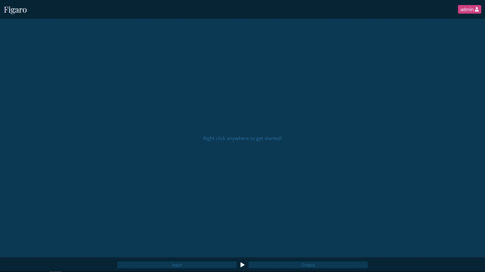
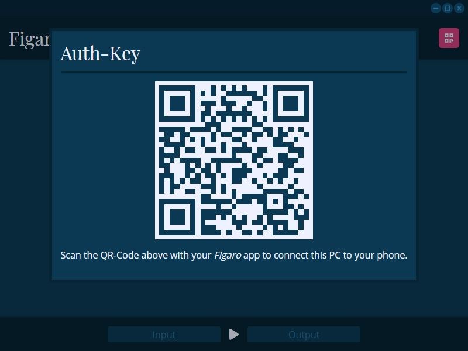
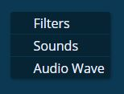
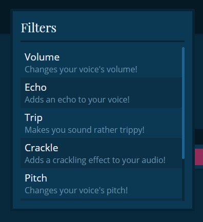
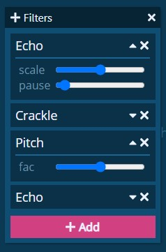
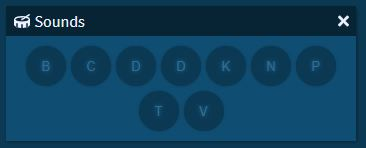
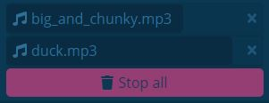
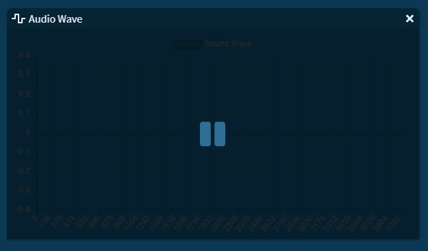
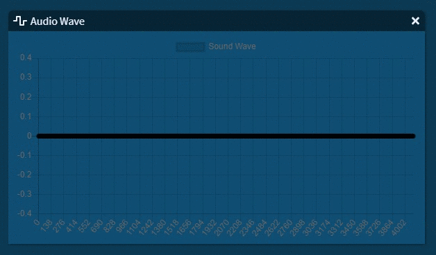
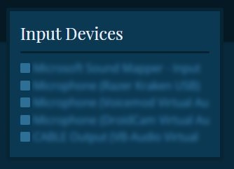

# GUI - Usage

## Launching

If you are using one of the releases available for download on the [release](https://github.com/MattMoony/figaro/releases) page, simply starting *Figaro* should already present you with its GUI.

### Development

At the moment, the easiest way to run Figaro's GUI in your development environment, depending on the platform you're on, is to simply run the appropriate script from the project's root directory.

* Linux & macOS: `./gui.sh`
* Windows: `.\gui.ps1`

... bear in mind that for this to work, however, you should also launch the `gatsby` development environment for the web part of the GUI in a separate shell:

```bash
cd lib/gui/web
npm run dev
```

## Basic GUI Usage

When first opening Figaro, the GUI will, in fact, look astonishingly empty:

<p align="center">
  
</p>

... but do not worry... for _it's not a bug, it's a feature_! The helpful little message in the center of the screen might have reassured you that you did not crash the program already (or at least, I sincerely hope so ^^), but that this empty appearance is purely a design choice.

The general structure of the Figaro GUI is the following:

<p align="center">
  
</p>

... most of it is self-explanatory, but more information on the individual GUI components can be found in the [next section](#gui-components)

## GUI Components

### Title- / Controlbar

Your classical window controlbar that grants you the controls you'd normally find on every window: *minimize*, *toggle maximize*, *close*.


### Header



Despite the general _Figaro_ heading, the most important thing that can be found here, is the button that will show you the QR code for authenticating mobile devices in future updates.

Other than that, at the moment, there's not much more functionality in this header part of the program. _Stay tuned for Figaro's mobile app, however... ^^_

### Workspace

If you have read through the readme completely, or even just partially, you will, by now, probably be wondering where all the promised features are - do not worry, it wasn't false advertising, since the _Workspace_ area is where most of the magic happens.

Figaro was designed to provide a desktop-like experience - something you most likely already are familiar with. So most of the main features live in window-like components in the main part of the GUI (the workspace).



To open such a window, simply _right click_ anywhere on the workspace area in the center of the screen. This will open a context menu that allows for a choice of a feature to be made.

#### Filters

Upon opening the *Filters* workspace component, you won't see too much, apart from a big pink *"Add"* button - click on it and you'll be able to add any one of the filters you have installed to your current audio stream.

Click on one or multiple to select them and then simply click outside the popup to hide it again. You'll now see all of the currently applied filters in the dragable filters window.

To modify any of the running filters' settings / options, simply open the filters dropdown menu and adjust any one of their individual sliders.

<div align="center">
  
  
</div>

#### Sounds

The "Sounds" workspace component grands you full control over all sound files located in the default directory `res/sounds`. The component window itself consists of several buttons, depending on the amount of sound effects you have. By pressing one of the buttons, you start the corresponding sound effect.

<p align="center">
  
</p>

_To be able to differentiate between sound effects, the full filename is displayed when hovering over a button._

To see which sound effects are currently playing and how long they will be playing for, all one has to do is to look to the bottom right corner of the workspace - a list of all sound effects and their individual progress will be displayed here.

<p align="center">
  
</p>

As you can probably imagine, the individual `x`s next to the sound effects' names are for stopping that sound effect, whereas the red `Stop all` button at the bottom is for stopping all currently playing sound effects (unbelievable, I know ^^).

#### Audio Wave

The audio wave feature is, similarly to its CLI counterpart a live graph of the audio data being channeled through Figaro - just in a more comprehensible / more presentable fashion.

(Altough I have thoroughly tried to optimize this feature and despite it running without any _lag_ or performance issues on my system, if you do actually encounter any problems, feel free to file an _issue report_ and I will happily try to make it work even better.)

##### Paused state

Whenever the Figaro is not running, the window will appear in the following way:

<p align="center">
  
</p>

##### Active state

However, when Figaro is running and channeling audio, you will be able to see the according _sound wave_ depicted properly:

<p align="center">
  
</p>

### Footer

This component at the very bottom of the screen provides the general controls for the audio stream: Which input sources to use, which output destinations to use and whether to start or stop channeling audio.

#### Start / Stop


I think this component might as well be the very definition of self-explanatory so i will not spend to many words on describing it: Simply press the button to toggle between start and stop.

#### I/O Device Selection

The areas to the left and right of the start/stop button are reserved for the input and output devices of your choosing. To select or deselect one, simply press on the area and check or uncheck the box next to the device in the following popup dialog:

<p align="center">
  
</p>

---

_Further documentation will most definitely follow in the not so far future. Until now, I sincerely hope that this has been helpful, informative and most importantly interesting._