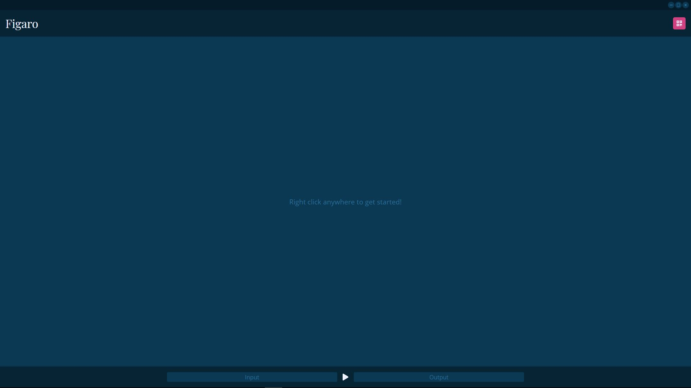

# GUI - Usage

To be able to use Figaro's GUI, you first need to start the Figaro CLI and its websocket server ...

```bash
$ python figaro.py -s
```

... if doing this for the first time, you will be entering into the initial setup and configuration process ...

## Setup and Configuration

First, you will be asked to create an admin account by providing both username and password ... 

<p align="center">
  
</p>

... after that you will be asked how long the JWT-secret key should be - the default option being `512 bits`. Although it is your choice remember that a key length of `< 256 bits` [is not recommended](https://tools.ietf.org/html/rfc7518#section-3.2) and a key length of `>= 512 bits` [is preferrable](https://auth0.com/blog/brute-forcing-hs256-is-possible-the-importance-of-using-strong-keys-to-sign-jwts/) ...

<p align="center">
  
</p>

... and that's it. After completing these dialogs, you will be taken to the regular Figaro CLI prompt. So... time to switch to the actual GUI part.

## Basic GUI Usage

When first opening the Figaro GUI, you will very politely be asked to login to verify your identity ...

<p align="center">
  
</p>

... you can open the login dialog by simply pressing the noticeably pink button in the top right corner (_what a surprise_) ...

<p align="center">
  
</p>

... simply fill the inputs with the information from one of the accounts you have created and, _et voilà_, you are presented with the Figaro GUI in all its glory! ... Except... not really 😄. 

When first signing in, the GUI will, in fact, look astonishingly empty: 

<p align="center">
  
</p>

... but do not worry... for _it's not a bug, it's a feature_! The helpful little message in the center of the screen might have reassured you that you did not crash the program already (or at least, I sincerely hope so ^^), but that this empty appearance is purely a design choice.

The general structure of the Figaro GUI is the following:

<p align="center">
  
</p>

... most of it is self-explanatory, but more information on the individual GUI components can be found in the [next section](#gui-components)

## GUI Components

### Header

Despite the general _Figaro_ heading, the most important thing that can be found here, is the button to open the login/logout prompts. The individual dialogs shouldn't be too difficult to interact with, so feel free to skip this part.

Since you are reading this, I think I can rightfully assume that you're interested in a detailed description of how to interact with this button and the subsequent dialogs. Since the process of logging in has already been covered in the [setup and configuration](#setup-and-configuration) section of this usage guide, I'll only cover the logout dialog here.

#### Logout

Once you are logged in (you can easily check if this is true by looking at the button in the top right corner of your screen, if it contains a username + a user icon, you have, in fact, successfully been authenticated) you can choose to logout by simply pressing the same button you used to log in again.

This will present you with the following dialog, where all you have to do is confirm your choice:

<p align="center">
  
</p>

### Workspace

If you have read through the readme completely, or even just partially, you will, by now, probably be wondering where all the promised features are - do not worry, it wasn't false advertising, since the _Workspace_ area is where most of the magic happens.

Figaro was designed to provide a desktop-like experience - something you most likely already are familiar with. So most of the main features live in window-like components in the main part of the GUI (the workspace).


To open such a window, simply _right click_ anywhere on the workspace area in the center of the screen. This will open a context menu that allows for a choice of a feature to be made.

#### Filters

_soon to be implemented and documented_

#### Sounds

The "Sounds" workspace component grands you full control over all sound files located in the default directory `res/sounds`. The component window itself consists of several buttons, depending on the amount of sound effects you have. By pressing one of the buttons, you start the corresponding sound effect.

<p align="center">
  
</p>

_To be able to differentiate between sound effects, the full filename is displayed when hovering over a button._

To see which sound effects are currently playing and how long they will be playing for, all one has to do is to look to the bottom right corner of the workspace - a list of all sound effects and their individual progress will be displayed here.

<p align="center">
  
</p>

As you can probably imagine, the individual `x`s next to the sound effects' names are for stopping that sound effect, whereas the red `Stop all` button at the bottom is for stopping all currently playing sound effects (unbelievable, I know ^^).

#### Audio Wave

The audio wave feature is, similarly to its CLI counterpart a live graph of the audio data being channeled through Figaro - just in a more comprehensible / more presentable fashion.

(Altough I have thoroughly tried to optimize this feature and despite it running without any _lag_ or performance issues on my system, if you do actually encounter any problems, feel free to file an _issue report_ and I will happily try to make it work even better.)

##### Paused state

Whenever the Figaro is not running, the window will appear in the following way:

<p align="center">
  
</p>

##### Active state

However, when Figaro is running and channeling audio, you will be able to see the according _sound wave_ depicted properly:

<p align="center">
  
</p>

### Footer

This component at the very bottom of the screen provides the general controls for the audio stream: Which input sources to use, which output destinations to use and whether to start or stop channeling audio.

#### Start / Stop


I think this component might as well be the very definition of self-explanatory so i will not spend to many words on describing it: Simply press the button to toggle between start and stop.

#### I/O Device Selection

The areas to the left and right of the start/stop button are reserved for the input and output devices of your choosing. To select or deselect one, simply press on the area and check or uncheck the box next to the device in the following popup dialog:

<p align="center">
  
</p>

---

_Further documentation will most definitely follow in the not so far future. Until now, I sincerely hope that this has been helpful, informative and most importantly interesting._